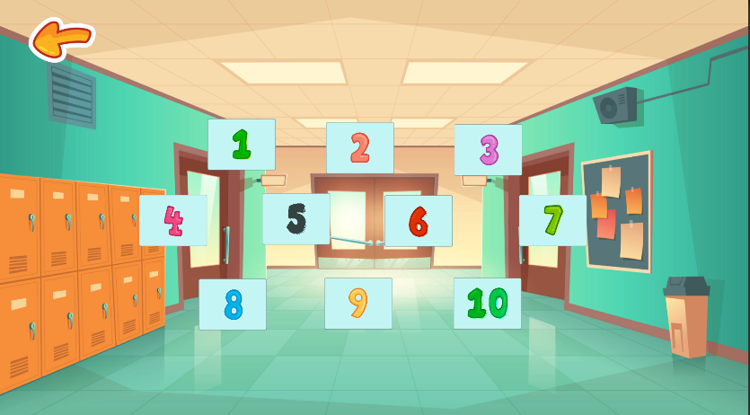
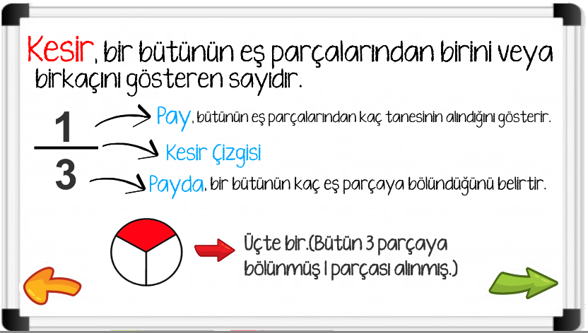

# Kesirler-Matematik Oyunu

Kesirler uygulaması Ankara Kalkınma Ajansı koordinasyonunda Türkiye Oyun Geliştiricileri Derneği (TOGED) ve ODTÜ TEKNOKENT A.Ş. iş birliği ile 3.-5. sınıflar için matematik öğretmek amacıyla yaptığı yarışma için geliştirilen bir oyun uygulamasıdır.

## Giriş - Oyunun Amacı
Mobil oyunların önemli bir eğlence aracı olduğu ve her yaştan insan için iyi vakit geçirdiğini söylemek yanlış olmaz. Covid-19 etkisiyle eğitim programlarından uzak kalan öğrenciler için mobil oyunların öğretim hedeflerini aktarmak için kullanılabileceği fikri son derece mantıklıdır.

Proje kapsamında geliştirilen oyunun ilköğretim üçüncü sınıf öğrencilerine yardımcı olması hedeflenmektedir. Böylece bu öğrenciler dönem içinde verilen dersleri pekiştirebilirler. Proje kapsamında geliştirilen oyunda kesirler konusu yer aldı. Oyunlar üçüncü sınıf matematik müfredatına uygun olarak geliştirildi.

## İçerik
* [Genel Bilgi](#genel-bilgi)
* [İçerik](#içerik)
* [Nasıl Oynanır](#nasıl-oynanır)

## Genel Bilgi
Kesirler uygulaması öğrencilerin evde geçirdikleri zamanda kesirler konusuna çalıştıklarında konuyu daha iyi pekiştirmelerine yardımcı olmak için tasarlandı.Uygulama ilkokul 3. sınıf matematik(kesirler )müfredatını destekleyecek eğlenceli ve basit oyun seviyelerinden oluşmaktadır.

## İçerik
Oyunda 10 adet bölüm bulunmaktadır. 

Oyunu oynayan öğrencilerin temel bilgi düzeyleri bilinmediğinden oyunun bazı bölümlerinde oyuna başlamadan önce kısa bir şekilde kavramlar gösterilmektedir.

Oyun içinde Bütün, Yarım, Çeyrek, Kesir, Pay, Payda, Birim Kesir gibi 3.Sınıf Kesirler konusu müfredatında varolan kavramlar öğrenciye gösterilmiştir.
